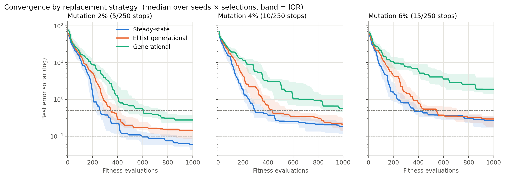
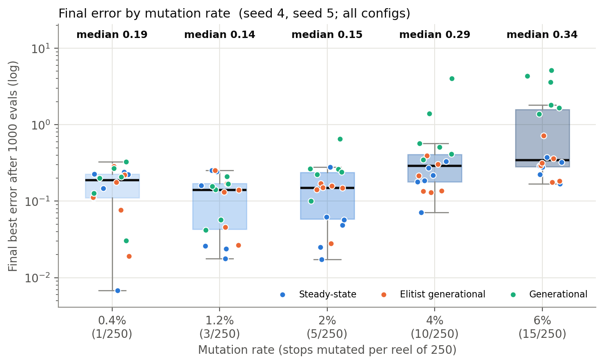
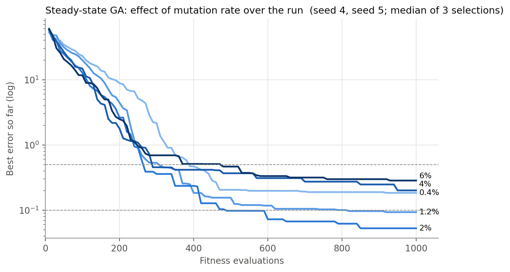
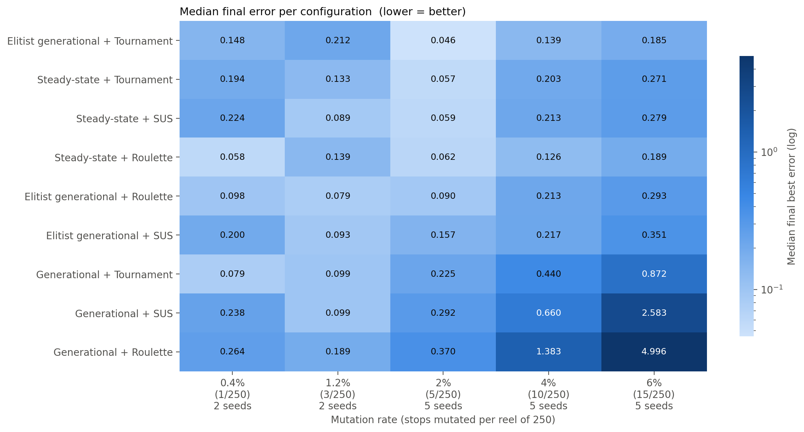
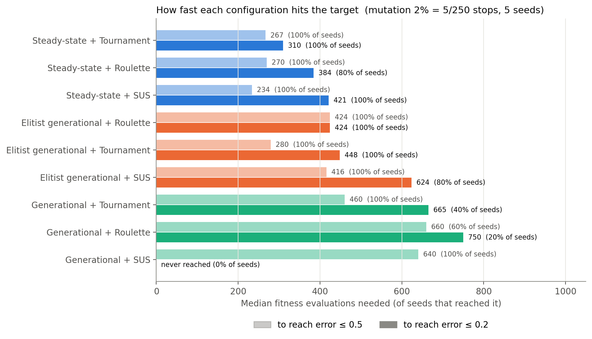
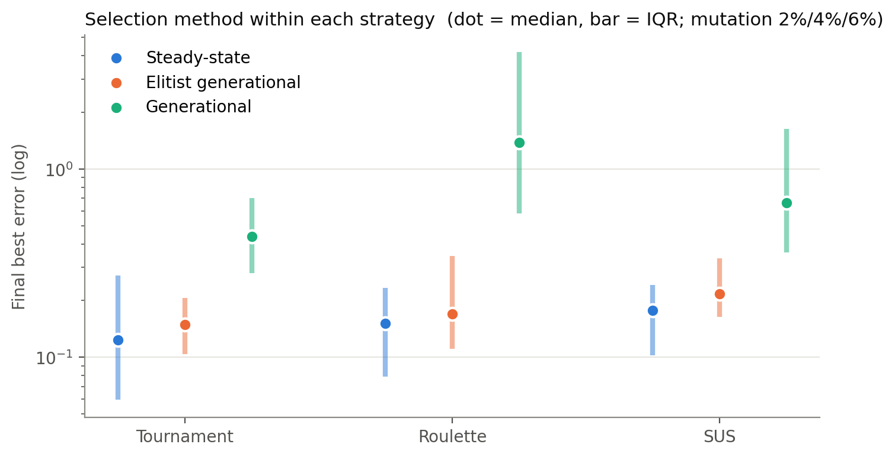
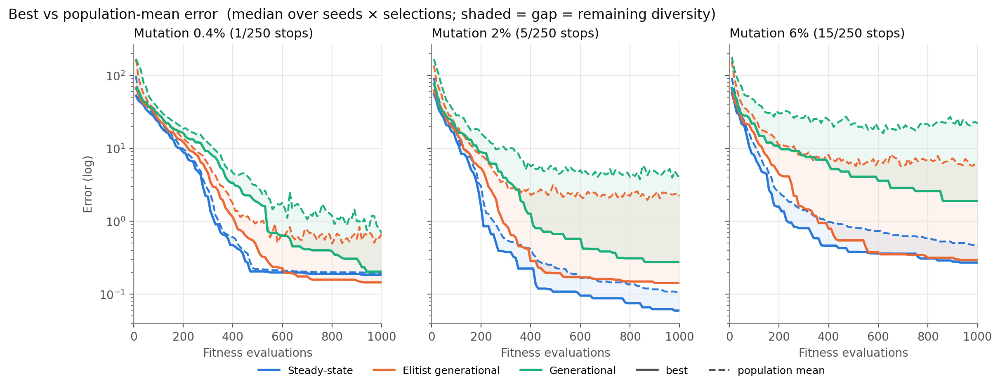
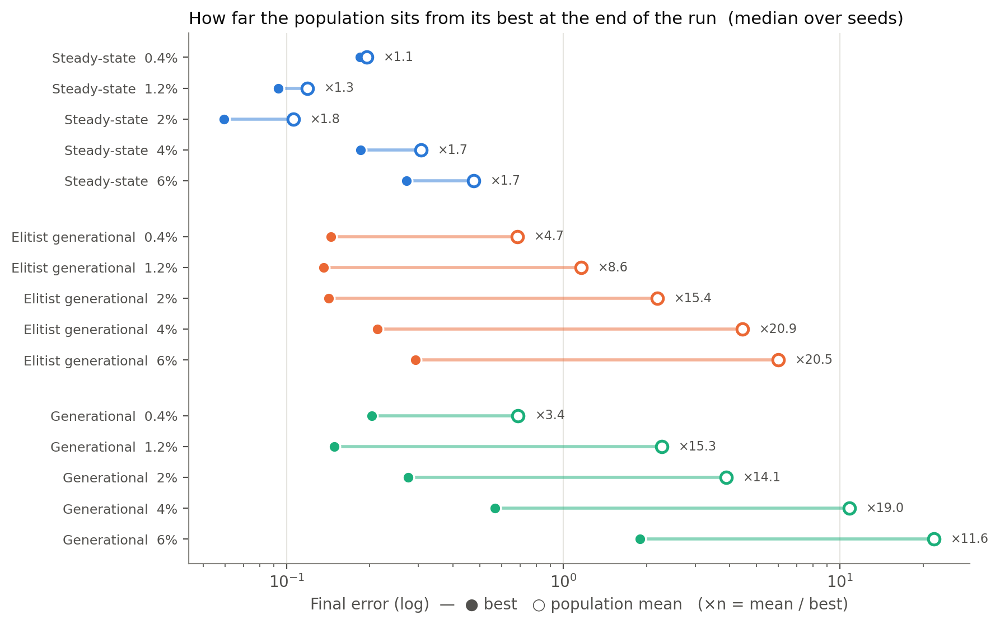

# Slot Math Tuning with a Genetic Algorithm

Designing reel strips by hand is slow. You change a few symbols, simulate, check the
RTP, and repeat until the numbers look right. This project automates that loop.

A C++ simulator spins a reelset millions of times and reports its statistics. A
Python genetic algorithm (GA) keeps a small population of reelsets, breeds new ones
from the best, and gradually pushes them towards the targets you set: RTP, hit rate,
free-game trigger rate, and so on.

The first half of this README explains how the GA works and what we learned from
comparing different GA setups. The second half shows how to install, build and run
the project.

## Contents

**Part 1: The genetic algorithm**

1. [How it works](#1-how-it-works)
2. [The experiment](#2-the-experiment)
3. [Results](#3-results)
4. [Comparison at a glance](#4-comparison-at-a-glance)
5. [Conclusion](#5-conclusion)
6. [Limits and next steps](#6-limits-and-next-steps)

**Part 2: Setup and usage**

7. [Project layout](#7-project-layout)
8. [Install the tools](#8-install-the-tools)
9. [Get the simulator](#9-get-the-simulator) (download or build)
10. [Set up Python](#10-set-up-python)
11. [Point the config at the simulator](#11-point-the-config-at-the-simulator)
12. [Run the optimizer](#12-run-the-optimizer)
13. [Changing the config](#13-changing-the-config)
14. [Output files and charts](#14-output-files-and-charts)
15. [Troubleshooting](#15-troubleshooting)

---

# Part 1: The genetic algorithm

## 1. How it works

Each member of the population (a "parent") is a complete reelset: 5 base-game reels
and 5 free-game reels, each 50 stops long. A run goes like this:

```
start with 10 reelsets, simulate each one, score it
repeat:
    pick parents to breed           (selection)
    mix and tweak them into children (crossover + mutation)
    simulate and score the children
    decide who stays in the population (replacement)
keep the best reelset found along the way
```

In BaseGame mode only the base reels change. In FreeGame mode the base reels stay
fixed and only the free reels evolve.

### Scoring a reelset (fitness)

Every goal has a target _t_ and a weight _w_, and the simulator measures the actual
value _x_. The score is the weighted sum of relative errors:

$$F = \sum_i w_i \cdot \frac{|x_i - t_i|}{t_i}$$

Lower is better, and 0 means every target is hit exactly. Using _relative_ error
lets goals with very different scales sit side by side: an RTP of about 0.57 next to
a trigger rate of about 80. The weights say how much each goal matters.

### Picking parents (selection)

We compared three methods:

- **Tournament.** Draw 3 reelsets at random and keep the best one. Repeat once for
  every parent you need. Simple, and it strongly favours good reelsets.
- **Roulette.** Every reelset gets a slice of a wheel, and better reelsets get bigger
  slices. Each spin of the wheel picks one parent.
- **SUS (Stochastic Universal Sampling).** The same wheel, but spun only once, with
  evenly spaced pointers, one per parent needed. Every reelset gets picked very close
  to its fair share, with less luck involved than roulette.

Roulette and SUS size the slices by **rank**, not by raw score. That matters early
on, when errors can be in the hundreds and one lucky reelset would otherwise take
over the whole wheel. Reelsets are ranked from worst (_r_ = 1) to best (_r_ = _N_),
and each gets the weight:

$$w(r) = (2 - s) + 2(s - 1)\,\frac{r - 1}{N - 1}, \qquad s = 2$$

With _s_ = 2, the worst reelset gets weight 0 and the best gets 2.

### Making children (crossover and mutation)

- **Crossover.** For each reel, pick a random cut point between stop 1 and 49. The
  child's reel is the first parent's reel up to the cut, then the second parent's
  reel after it.
- **Mutation.** Pick N random stops anywhere in the reelset (all 250 stops across
  the 5 reels) and change each to a different symbol. N is the "mutation count" used
  throughout this README. A count of 5 changes 5 of 250 stops, about one per reel.

### Deciding who survives (replacement)

| Strategy             | What happens each step                                                        | Children per step |
| -------------------- | ----------------------------------------------------------------------------- | ----------------- |
| Steady-state         | Make one child. If it beats the worst reelset, it takes that reelset's place. | 1                 |
| Generational         | Make 10 children. They replace the whole population.                          | 10                |
| Elitist generational | Keep the 2 best reelsets, and fill the other 8 places with children.          | 8                 |

The strategies make different numbers of children per step, so comparing them by
"generations" would be unfair. Instead, every run gets the same budget of **1000
fitness evaluations** (simulator runs). That works out to 1000 steps for
Steady-state, 100 for Generational and 125 for Elitist.

## 2. The experiment

We tuned the **base game** only, with three goals:

| Goal                   | Target | Weight |
| ---------------------- | ------ | ------ |
| Base RTP               | 0.57   | 10     |
| Base hit rate          | 3      | 5      |
| Free-game trigger rate | 80     | 3      |

| Setting              | Value                                               |
| -------------------- | --------------------------------------------------- |
| Population           | 10 reelsets                                         |
| Spins per evaluation | 10,000,000                                          |
| Budget per run       | 1000 evaluations                                    |
| Configurations       | 3 replacement strategies × 3 selection methods = 9  |
| Mutation counts      | 5, 10 and 15 (5 seeds each); 1 and 3 (2 seeds each) |
| Total runs           | 171                                                 |

A **seed** here means a different random starting population. The best reelset in
each starting population had an error between 27 and 51, so every run started a long
way from the targets.

The charts below show the **median** across seeds (and across selection methods, where
a chart combines them), so a single lucky or unlucky run doesn't skew the picture.

## 3. Results

### Steady-state converges fastest and ends lowest



Each line is the best error found so far, plotted against evaluations used. The
shaded band shows the middle half of the runs.

Steady-state (blue) drops fastest and ends lowest at every mutation count. With a
mutation count of 5 it finished at a median error of **0.059**, against 0.142 for
Elitist and 0.275 for plain Generational.

Plain Generational (green) is the clear loser, and it gets worse as mutation
increases: its median final error climbs from 0.28 at a mutation count of 5 to 1.89
at 15. Elitist sits in between and catches up with Steady-state only when mutation
is strong.

### A little mutation goes a long way





| Mutation count (stops changed out of 250) | 1     | 3     | 5     | 10    | 15    |
| ----------------------------------------- | ----- | ----- | ----- | ----- | ----- |
| Median final error, all configurations    | 0.189 | 0.141 | 0.142 | 0.271 | 0.359 |
| Median final error, Steady-state only     | 0.184 | 0.093 | 0.059 | 0.185 | 0.271 |

The sweet spot is **3 to 5 changed stops per child**. With just 1, the search creeps
along: in the Steady-state chart that line lags behind until about 400 evaluations
and then stalls. With 10 or 15, mutation wrecks good reelsets about as often as it
improves them, and runs get stuck around 0.2 to 0.3.

### Every configuration side by side



The lightest cells are all at a mutation count of 5: **Elitist + Tournament (0.046)**
and **Steady-state with any of the three selection methods (0.057 to 0.062)**. The
darkest corner is plain Generational at 10 to 15, with errors up to 5.0. The columns
for 1 and 3 come from only two seeds each, so take them with a pinch of salt.

### How quickly each setup reaches a good result



At a mutation count of 5, here is how many evaluations each setup needed to get the
error down to 0.5 and to 0.2, and on how many of the 5 seeds it got there at all:

| Configuration             | Error ≤ 0.5   | Error ≤ 0.2   |
| ------------------------- | ------------- | ------------- |
| Steady-state + Tournament | 267 (5/5)     | **310 (5/5)** |
| Steady-state + Roulette   | 270 (5/5)     | 384 (4/5)     |
| Steady-state + SUS        | **234 (5/5)** | 421 (5/5)     |
| Elitist + Tournament      | 280 (5/5)     | 448 (5/5)     |
| Elitist + Roulette        | 424 (5/5)     | 424 (5/5)     |
| Elitist + SUS             | 416 (5/5)     | 624 (4/5)     |
| Generational + Tournament | 460 (5/5)     | 665 (2/5)     |
| Generational + Roulette   | 660 (3/5)     | 750 (1/5)     |
| Generational + SUS        | 640 (5/5)     | never (0/5)   |

Steady-state + Tournament reached an error of 0.2 in about a third of the budget and
did it on every seed. Plain Generational reached 0.2 on at most 2 of 5 seeds.

Going further, to an error of 0.1, at mutation counts 5, 10 and 15: Steady-state got
there in 15 of 45 runs, Elitist in 7 of 45, and plain Generational never did.

### Selection matters less than you'd think



Median final error over mutation counts 5, 10 and 15:

|                      | Tournament | Roulette | SUS   |
| -------------------- | ---------- | -------- | ----- |
| Steady-state         | **0.124**  | 0.151    | 0.177 |
| Elitist generational | **0.149**  | 0.170    | 0.217 |
| Generational         | **0.440**  | 1.383    | 0.660 |

Tournament comes out on top for every strategy, but with Steady-state or Elitist the
gaps are small. Which replacement strategy you choose makes a much bigger difference
than which selection method you pair it with. The exception is plain Generational:
there, selection is the only thing steering the population towards good reelsets, so
a weak choice (Roulette) hurts a lot.

### Diversity: how alike the population becomes





The gap between the best reelset and the population average tells us how varied the
population still is.

- **Steady-state** ends with almost everyone as good as the best: the average is only
  1.1 to 2 times the best error. That's why it converges so quickly. The downside is
  that once all ten reelsets are near-copies of each other, there is little left to
  recombine. You can see the curves flatten after about 600 evaluations.
- **Elitist** keeps the population much more varied: the average is 5 to 24 times the
  best. Eight fresh children arrive every generation, while the two elites make sure
  the best reelset is never lost.
- **Plain Generational** keeps losing its best reelset. In all 57 Generational runs,
  the best reelset in the final generation was worse than the best one the run had
  found earlier, by a median factor of 4.1. Every reelset is replaced each
  generation, so a good one only survives if a child happens to match it.

## 4. Comparison at a glance

|                                                     | Steady-state       | Elitist generational   | Generational       |
| --------------------------------------------------- | ------------------ | ---------------------- | ------------------ |
| Median final error (mutation 5)                     | **0.059**          | 0.142                  | 0.275              |
| Best single configuration (mutation 5)              | 0.057 (Tournament) | **0.046** (Tournament) | 0.225 (Tournament) |
| Evaluations to error ≤ 0.2 (Tournament, mutation 5) | **310**            | 448                    | 665                |
| Runs reaching error ≤ 0.1 (mutation 5–15)           | **15 / 45**        | 7 / 45                 | 0 / 45             |
| Population diversity at the end                     | low                | **high**               | medium             |
| Keeps its best reelset                              | yes                | yes                    | no                 |
| Sensitivity to strong mutation                      | moderate           | moderate               | high               |
| Best selection method                               | Tournament         | Tournament             | Tournament         |

## 5. Conclusion

**Steady-state replacement with Tournament selection and a mutation count of 5 is the
setup to use.** It reaches a good result fastest (error 0.2 in about 310 evaluations),
does it reliably (all 5 seeds), and ends among the lowest errors (median 0.057).

```yaml
experiments:
  replacementTypes: [SteadyState]
  selectionTypes: [TournamentSelection]
  mutationCounts: [5]
```

A few more takeaways:

- **Elitist + Tournament is a strong second.** It had the single best median (0.046)
  but needed more evaluations to get there. Because it keeps the population diverse,
  it is the better bet for longer runs, where Steady-state tends to stall.
- **Avoid plain Generational.** It is the slowest, keeps losing its best reelset, and
  falls apart under stronger mutation.
- **Keep mutation gentle.** Changing 3 to 5 stops per child (out of 250) worked best.
  More than that consistently made things worse, and a single stop was too slow for
  a 1000-evaluation budget.
- **Get the replacement strategy right first.** Selection fine-tunes the result;
  replacement decides it.

### Beyond slots

The same approach fits any problem where a solution is an arrangement of discrete
pieces, can only be judged by simulation, and has to balance several noisy targets.
Close relatives include other casino and lottery games (paytables, prize tables),
game-economy balancing (loot and drop rates), timetabling and scheduling, and
simulation-driven engineering design (NASA's ST5 antenna was evolved this way). The
lessons here carry over: use Steady-state with Tournament when evaluations are
expensive, always keep the best solution, and mutate gently.

## 6. Limits and next steps

- **Small samples.** Five seeds per cell (two for mutation counts 1 and 3) is enough
  to trust the big patterns, such as Generational being worst and strong mutation
  hurting. It isn't enough to trust differences of a few hundredths between close
  configurations.
- **Noisy scores.** Every score comes from 10 million simulated spins, so it carries
  some random noise. Before using a reelset for real, re-check it with many more spins
  (set `finalCheckSpins: 100_000_000`).
- **One budget.** All conclusions are for 1000 evaluations. With longer runs, the more
  diverse Elitist strategy may overtake Steady-state.
- **Things worth trying:** injecting fresh random reelsets when Steady-state stalls;
  starting with strong mutation and reducing it over time; replacement that protects
  diversity (for example, a child replaces only the reelset most similar to it); and
  running the same comparison for the free game.

---

# Part 2: Setup and usage

## 7. Project layout

```
<project root>/                      <- run every command from here
├── GA-config.yaml                   <- all optimizer settings
├── Requirements.txt                 <- Python packages
├── ReadMe.md
├── .gitignore
├── Optimizer/                       <- Python genetic algorithm
│   ├── main.py                      <- entry point
│   ├── Config.py                    <- reads and checks GA-config.yaml
│   ├── Parents.py                   <- reelset (parent) class and fitness
│   ├── Selection.py                 <- Tournament, Roulette, SUS, crossover, mutation
│   ├── Replacement.py               <- Steady-state, Generational, Elitist
│   ├── Utility.py                   <- runs the simulator, reads and saves files
│   ├── FitnessFunction.py
│   ├── Compare.py                   <- draws the comparison charts
│   ├── ReelSets/                    <- reelset files used during a run
│   ├── Results/
│   └── Runs/
├── Results/                         <- results.json and the charts
├── Simulator/                       <- C++ simulator
│   ├── CMakeLists.txt
│   └── src/
│       ├── main.cpp                 <- entry point, command-line handling
│       ├── constants.hpp            <- game constants (matrix size, paytable, ...)
│       ├── reelsFunction.hpp        <- reads reelsets, builds the spin matrix
│       ├── WinningFunctions.hpp     <- win evaluation
│       ├── reelset.json             <- default reelset when none is passed
│       ├── multiThread/
│       │   └── SimRunner.hpp        <- runs spins on several threads
│       ├── Stats/                   <- statistics collected during a simulation
│       │   ├── simResult.hpp
│       │   ├── baseMatrixData.hpp   freeMatrixData.hpp
│       │   ├── buyFreematrixData.hpp  reelMatrixData.hpp
│       │   └── symbolsData.hpp
│       └── Utility/
│           ├── MiniJson.hpp         <- writes the JSON result file
│           └── Utilities.hpp
└── build/                           <- created when you build the simulator
```

Paths in `GA-config.yaml` are relative to the project root, so always run commands
from there.

## 8. Install the tools

The project supports **Linux** (Debian / Ubuntu) and **Windows**. You'll need:

| Tool                            | Version                                         | Used for                              |
| ------------------------------- | ----------------------------------------------- | ------------------------------------- |
| Python                          | 3.10+                                           | running the optimizer (always needed) |
| C++ compiler with C++20 support | GCC 11+ (Linux) or Visual Studio 2022 (Windows) | building the simulator yourself       |
| CMake                           | 3.20+                                           | building the simulator yourself       |

You only need the C++ compiler and CMake if you build the simulator yourself. If you
download the ready-made simulator from the Releases page instead
([section 9, option A](#option-a-download-a-ready-made-simulator)), Python is all you
need:

| OS              | Install Python only                                                                    |
| --------------- | -------------------------------------------------------------------------------------- |
| Ubuntu / Debian | `sudo apt install python3 python3-venv python3-pip`                                    |
| Fedora          | `sudo dnf install python3 python3-pip`                                                 |
| Arch / Manjaro  | `sudo pacman -S python python-pip`                                                     |
| Windows         | Install from <https://www.python.org/downloads/> and tick **"Add python.exe to PATH"** |

To build it yourself, install everything for your OS:

### Ubuntu / Debian

```bash
sudo apt update
sudo apt install build-essential cmake python3 python3-venv python3-pip
```

### Fedora

```bash
sudo dnf install gcc-c++ make cmake python3 python3-pip
```

### Arch / Manjaro

```bash
sudo pacman -S base-devel cmake python python-pip
```

### Windows

1. Install **Visual Studio 2022 Build Tools** and tick the
   **"Desktop development with C++"** workload. This gives you both the compiler and
   CMake. Download it from <https://visualstudio.microsoft.com/downloads/>, under
   _Tools for Visual Studio_ → _Build Tools_.
2. Install **Python 3.10 or newer** from <https://www.python.org/downloads/>. In the
   installer, tick **"Add python.exe to PATH"**.

If you prefer `winget`, in PowerShell:

```powershell
winget install Microsoft.VisualStudio.2022.BuildTools --override "--add Microsoft.VisualStudio.Workload.VCTools --includeRecommended --passive"
winget install Kitware.CMake
winget install Python.Python.3.12
```

On Windows, run the build commands from the **"Developer PowerShell for VS 2022"**
(it's in the Start menu), so the compiler can be found.

### Check that it worked

Open a new terminal and run:

```bash
cmake --version          # 3.20 or newer
python3 --version        # 3.10 or newer   (Windows: python --version)
g++ --version            # Linux only
```

## 9. Get the simulator

There are two ways to get the simulator program:

- **Option A: download it** from the Releases page. This is the quickest way, with no C++
  tools needed.
- **Option B: build it yourself.** Use this if you want to change the game's C++ code,
  or if the downloaded Linux program doesn't run on your distribution.

### Option A: download a ready-made simulator

1. Open the **Releases** page of this repository. On GitHub, click **Releases** in the
   right-hand sidebar of the repository page, or add `/releases` to the end of the
   repository's URL.
2. Under the latest release, open **Assets** and download the file for your system,
   for example:

   | System                  | File                        |
   | ----------------------- | --------------------------- |
   | Windows                 | `simulator-windows-x64.exe` |
   | Linux (Debian / Ubuntu) | `simulator-linux-x64`       |

3. Create a `build` folder in the project root, move the file into it, and rename it to
   `simulator` (`simulator.exe` on Windows).

4. **Linux only:** allow it to run.

   ```bash
   chmod +x build/simulator
   ```

   **Windows only:** if SmartScreen warns about an unknown app the first time it runs,
   click **More info** → **Run anyway**.

5. Set the path in `GA-config.yaml` ([section 11](#11-point-the-config-at-the-simulator)):

   ```yaml
   paths:
     simulatorPath: build/simulator # Windows: build/simulator.exe
   ```

6. Test it with 100,000 spins. Pass the reelset file explicitly, because the downloaded
   program doesn't know where your project folder is:

   ```bash
   ./build/simulator 100000 Simulator/src/reelset.json          # Linux
   build\simulator.exe 100000 Simulator\src\reelset.json        # Windows
   ```

   You should see a table of symbol stats, followed by a line starting with `RTP:`.

A few things to keep in mind with the download:

- **The game rules are built into the program.** The paytable, matrix size, free-spin
  rules and everything else in `Simulator/src` are fixed at the time of the release.
  If you change any C++ file, the download won't include your change; build it
  yourself (option B).
- **Linux:** the download is built on Debian / Ubuntu. On other distributions it may
  still work. If you see an error like `GLIBC_2.xx not found`, it was built on a newer
  Linux than yours, so build it yourself (option B).

### Option B: build it yourself

From the project root:

```bash
cmake -S Simulator -B build -DCMAKE_BUILD_TYPE=Release
cmake --build build --config Release -j
```

Always build in **Release** mode. A debug build can be many times slower, and the
optimizer calls the simulator thousands of times.

The finished program ends up here:

| OS                      | Simulator path                |
| ----------------------- | ----------------------------- |
| Linux                   | `build/simulator`             |
| Windows (Visual Studio) | `build/Release/simulator.exe` |

Give it a quick test with 100,000 spins on the built-in reelset:

```bash
./build/simulator 100000                    # Linux
build\Release\simulator.exe 100000          # Windows
```

You should see a table of symbol stats, followed by a line starting with `RTP:`.

Whenever you change the C++ code, rebuild. The optimizer always runs whatever binary
is in `build/`.

For reference, this is how the optimizer calls the simulator (you don't need to do
it yourself):

```
simulator <spins> <reelset.json> <runOnlyBase: true|false> <output.json>
```

`runOnlyBase = true` skips playing the free spins but still counts how often they
trigger. The optimizer uses it in BaseGame mode to save time.

## 10. Set up Python

Use a virtual environment: a private folder of packages just for this project, so
nothing clashes with your other Python projects.

**Linux**

```bash
python3 -m venv .venv
source .venv/bin/activate
pip install -r Requirements.txt
```

**Windows (PowerShell)**

```powershell
python -m venv .venv
.venv\Scripts\Activate.ps1
pip install -r Requirements.txt
```

If PowerShell complains that running scripts is disabled, run
`Set-ExecutionPolicy -Scope CurrentUser RemoteSigned` once and try again.

Once it's active, your prompt starts with `(.venv)`. Each time you open a new
terminal, run the `activate` line again. The `pip install` step is only needed once.

## 11. Point the config at the simulator

Open `GA-config.yaml` and set `simulatorPath` to where the simulator is (section 9):

```yaml
paths:
  simulatorPath: build/simulator # Linux (downloaded or built)
  # simulatorPath: build/simulator.exe            # Windows, downloaded
  # simulatorPath: build/Release/simulator.exe    # Windows, built yourself
```

Use forward slashes (`/`) in the config, even on Windows. If the path is wrong, the
optimizer tells you straight away (`Simulator not found at '...'`) instead of failing
halfway through a run.

## 12. Run the optimizer

From the project root, with the virtual environment active:

```bash
python Optimizer/main.py GA-config.yaml
```

### Start with a quick test

A real run can take hours, so make sure everything works with a tiny run first. Copy
the config:

```bash
cp GA-config.yaml quick-test.yaml        # Windows: copy GA-config.yaml quick-test.yaml
```

Then change these values in `quick-test.yaml`:

```yaml
run:
  runNumber: 999 # keeps test results apart from real ones
  generations: 20
  spins: 100_000
  finalCheckSpins: 0
```

And run it:

```bash
python Optimizer/main.py quick-test.yaml
```

If it finishes and `Results/results.json` appears, you're all set.

### What the output looks like

```
[parents] Using seed parents from Optimizer/ReelSets/seed_parents.json
Evaluating 10 initial parents...
parent0: fitness 115.2524, rtp 61.20 %
...
>> SteadyState + RouletteSelection | mutation 5 | 300 generations
Gen 1: child 98.1234 | replaced 3 (worst was 130.2001) | best 95.0000, mean dist 110.0000
...
Best ever: fitness 0.1543, found in generation 295 (last generation's best: 0.1543)
SteadyState_RouletteSelection took 1234.5s
```

The fitness is an error score: lower is better, and 0 would be a perfect match.

## 13. Changing the config

Every setting in `GA-config.yaml` has a comment explaining it. Here is what each
section is for.

### `run`

| Setting            | What it does                                                                                                                                                    |
| ------------------ | --------------------------------------------------------------------------------------------------------------------------------------------------------------- |
| `runNumber`        | A label for the run. Results are saved under `seed_<runNumber>`. Reuse a number to repeat a run on the same starting reelsets; use a new number to start fresh. |
| `generations`      | How long to run. Steady-state uses this number directly; the generational strategies divide it by the number of children they make per generation.              |
| `createNewParents` | `true` starts from random reelsets. `false` reuses saved ones (see below).                                                                                      |
| `populationSize`   | How many reelsets are in the population. 10 is typical.                                                                                                         |
| `spins`            | Spins per evaluation. More is more accurate but slower: `100_000` for tests, `10_000_000` for real runs.                                                        |
| `gameMode`         | `BaseGame` tunes the base reels. `FreeGame` keeps the base reels fixed and tunes the free reels.                                                                |
| `finalCheckSpins`  | After each experiment, re-test the best reelset with this many spins. `0` turns it off.                                                                         |

With `createNewParents: false`, the starting reelsets are looked up in this order:

1. `Results/results.json` → `seed_<runNumber>` → `initial_population`
2. the file in `paths.seedParentsFile`
3. if neither exists, new random reelsets are created

Only use `createNewParents: true` together with a new `runNumber`. Otherwise one run
number ends up holding results from different starting populations.

### `freeGame` (only used when `gameMode: FreeGame`)

`baseReelSource` decides where the fixed base reels come from:

- `same`: for each combination of settings, use the best base reels that **the same
  combination** found in the BaseGame run with the same `runNumber`. The free-game
  run also starts from that run's reelsets.
- `manual`: use one reelset file (`baseReelFile`) for every combination.

The usual workflow is two runs:

1. `gameMode: BaseGame`, `runNumber: 4`. Results are saved under `seed_4`.
2. `gameMode: FreeGame`, `runNumber: 4`, `baseReelSource: same`. This reads `seed_4`
   and saves its results under `seed_4_free`.

Keep the `experiments` section the same for both runs. With `same`, every free-game
combination needs a matching BaseGame result. If one is missing, the run stops at the
start and tells you which.

### `experiments`

Every combination of these three lists is run, one after another:

```yaml
experiments:
  replacementTypes: [SteadyState] # Generational, SteadyState, ElistismGenerational
  selectionTypes: [RouletteSelection, TournamentSelection] # RouletteSelection, TournamentSelection, SUS
  mutationCounts: [5] # stops changed per child, out of all 250
```

This example runs 1 × 2 × 1 = 2 experiments. To leave an option out, delete it or
comment it out with `#`.

### `reels`

`symbols`, `reelSize` (stops per reel) and `columnCount` (number of reels). These have
to match what the simulator expects.

### `fitnessVariables`

The goals to aim for, with one list per game mode. Only the list for the current
`gameMode` is used.

```yaml
fitnessVariables:
  BaseGame:
    - { type: baseRTP, target: 0.57, weight: 10, enabled: true }
    - { type: baseHitRate, target: 3, weight: 5, enabled: true }
    - { type: freeTriggerRate, target: 80, weight: 3, enabled: true }
  FreeGame:
    - { type: freeRTP, target: 0.38, weight: 10, enabled: true }
    - { type: freeHitRate, target: 2.7, weight: 5, enabled: true }
    - { type: freeRetriggerRate, target: 60, weight: 4, enabled: true }
```

- `target`: the value you want, in the same units the simulator reports.
- `weight`: how much this goal matters compared with the others.
- `enabled: false`: switch a goal off without deleting it.

Available types: `baseRTP`, `baseHitRate`, `freeRTP`, `freeHitRate`,
`freeTriggerRate`, `freeRetriggerRate`.

### `paths`

| Setting                | What it is                                        |
| ---------------------- | ------------------------------------------------- |
| `tempParentsFolder`    | Working folder for reelset files during a run     |
| `initialParentsFolder` | Where new random reelsets are written             |
| `seedParentsFile`      | Optional fixed set of starting reelsets           |
| `resultFile`           | Where results are saved                           |
| `simulatorPath`        | The simulator you downloaded or built (section 9) |

### When you make a mistake

The config is checked before anything runs, and problems come back as one clear line:

```
CONFIG ERROR: 'Basegame' is not valid for run.gameMode. Choose one of: BaseGame, FreeGame
CONFIG ERROR: run.spins must be a whole number, got '10m'
```

YAML cares about indentation. Use spaces, never tabs, and keep each item lined up
under its section the way the original file has it.

## 14. Output files and charts

Everything ends up in `Results/results.json`:

```
seed_<runNumber>                      <- BaseGame runs
  initial_population                  <- the reelsets the run started from
  results
    mutation_<n>
      <Replacement>_<Selection>
        results  [[best, mean], ...]  <- one entry per generation
        reelset  {BaseGameReel, FreeGameReel}   <- best reelset found
seed_<runNumber>_free                 <- FreeGame runs, same layout
```

To draw the comparison charts used in Part 1 (saved as PNG files in `Results/`):

```bash
python Optimizer/Compare.py
```

## 15. Troubleshooting

| Problem                                           | What to do                                                                                                                                                                |
| ------------------------------------------------- | ------------------------------------------------------------------------------------------------------------------------------------------------------------------------- |
| `CONFIG ERROR: Simulator not found at ...`        | Download or build the simulator (section 9) and set `simulatorPath` (section 11). On Windows the path ends in `.exe`.                                                     |
| `ModuleNotFoundError: No module named 'yaml'`     | The virtual environment isn't active. Run the `activate` line from step 10.                                                                                               |
| `JSONDecodeError: Expecting value`                | The simulator didn't write any output, usually because the program is out of date. Download the latest release or rebuild (section 9).                                    |
| `myapp failed (...)`                              | The simulator crashed, and its own error is printed underneath. Run it by hand (section 9) to dig in.                                                                     |
| Runs are very slow                                | Check that you built with `-DCMAKE_BUILD_TYPE=Release` and `--config Release`. For testing, lower `spins`.                                                                |
| Linux link error mentioning `pthread`             | On older Linux systems, add `find_package(Threads REQUIRED)` and `target_link_libraries(simulator PRIVATE Threads::Threads)` to `Simulator/CMakeLists.txt`, then rebuild. |
| `cmake` or `cl` not found on Windows              | Open the **Developer PowerShell for VS 2022** from the Start menu and try again.                                                                                          |
| `python3` not found on Windows                    | Use `python` instead of `python3`.                                                                                                                                        |
| Downloaded simulator: `Permission denied`         | Run `chmod +x build/simulator` (section 9, option A).                                                                                                                     |
| Linux: `GLIBC_2.xx not found`                     | The download was built on a newer Linux. Build it yourself (section 9, option B).                                                                                         |
| A FreeGame run says there are no BaseGame results | Run BaseGame first with the same `runNumber` and `experiments`, or switch to `baseReelSource: manual`.                                                                    |
